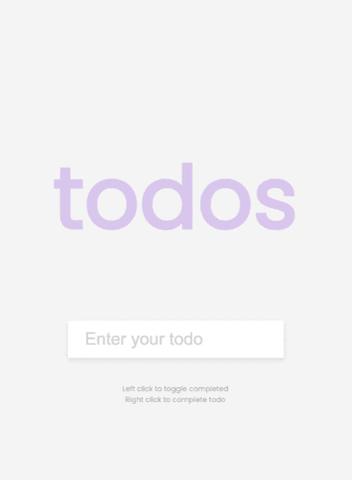

# Todo List
  

<a href="https://tomarapetty.github.io/todo/">Click here to see it in action.</a>

## Table of Contents
* [Description](#description)
* [Installation](#installation)
* [Usage](#usage)
* [License](#license)
* [Contributions](#contributions)
* [Tests](#tests)
* [Questions](#questions)

## Description 
*Overview of this project:* 
* The Todo list gives a place to take note of tasks that the user needs to complete. You can add things to the list check them off and then delete them. The items will be saved into local storage so if you refresh the page your notes will still be there.

## Installation
*Steps required to install project and get the development environment established:*
* Make a clone of this repo into a new repo of your own. There is an html, css, and js file so once you have that installed into your new repo, you can publish your site and it will function as shown in the usage section below.

## Usage
*Instructions and examples for use:* 
* Click into the text box to enter your todo. Press enter to add the todo to your list. Click on the todo if you would like to strike a line through in order to show that it is complete. Right click on the item in order to remove it from the list.

## License 
* Built under the MIT licence.

## Credits
* Built & designed by Tomara Petty

## Test
* No tests necessary.

## Questions?

 g
If you have any questions or want to make a contribution please reach out to me here: 

* GitHub: @TomaraPetty 
* Email: tomara.petty@gmail.com
* LinkedIn: https://www.linkedin.com/in/tomara-petty/
